# SCA Evaluation of OpenTitan ECC Primitives

## Setup

Refer to [README.md](README.md) for setup information.

## Clocking
The target and sampling clock is generated by the CW310's PLL. While
OpenTitan likes to run at 100 MHz (e.g. `cw310_loader.py` requires this),
a slower clock is required to capture full power traces for the long ECC
operations.

It may be possible to capture at 100 MHz, but at this clock frequency Husky
is limited to capturing 131070 samples per capture. It is possible to repeat
the same operation multiple time and assemble a single composite power trace
from these captures (using the ChipWhisperer `scope.adc.offset` feature),
however this is intended for when the target can be made to do the *exact*
same thing multiple times. By our observations, this is not possible with
the p256 or p384 operations: successive captures using the same inputs
result in traces which are not aligned.

For p256, the full operation can be captured with the target clocked at 25
MHz. With this clock speed we find that the target operation is constant in
time (measured by the number of clock cycles for which the output trigger
line is high), both across repeated runs and for different values of k.

For p384, *most* of the full operation can be captured with the target
clocked at 22 MHz: we can capture 16M samples, but the full operation is
~19M samples. A slower clock is required to capture the full operation, but
clocking under 22 MHz results in an unresponsive target. 16M samples is
still sufficient to carry out some initial analysis. As with p256, traces
collected at this clock speed have constant running time and align
perfectly.

## Firmware Resets
After each operation, OpenTitan firmware needs to be reloaded (see
`prog.run(target)` calls in the notebooks). If this is not done, the next
operation hangs on "Wait for done".

## Side-Channel Analysis

### Finding Bits
Raw power traces have a very regular appearance, with periodic sections of
higher activity separated by shorter sections of lower activity:

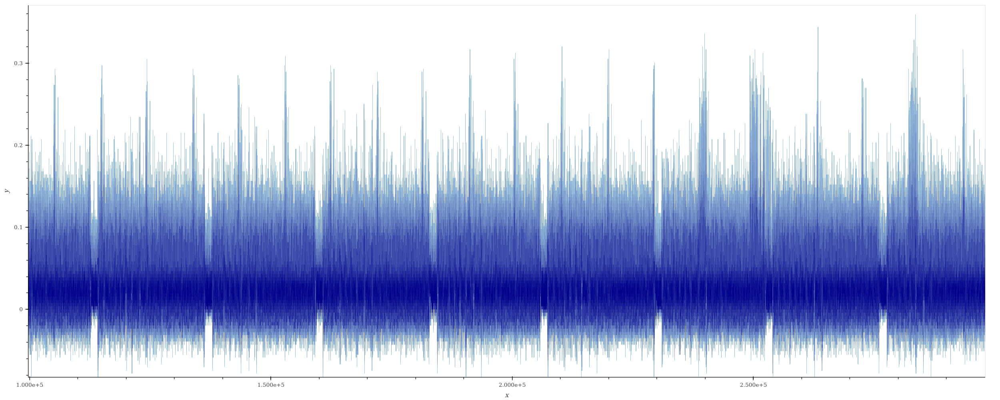

These sections are a roughly constant time throughout the full operation
(except for the very start and very end of the operation); moreover for p256
there are 512 such periods of high activity, and for p384 there are 768 such
periods. This suggests that each pair of high activity corresponds to the
processing of one bit of k in the point multiplication, and that each pair
consists of a double and an add. This is consistent with source code
comments indicating a "double and always add" point multiplication
implementation.

### Most Significant Bit Leakage
If we compare power traces for `k=0xffff...` and `k=0x1fff...`, we find that
the raw traces leak the position of the most significant bit of k. The two
traces overlayed show a significant different over 6 consecutive periods of
high activity, which we understand to correspond to `k[255:253]`:
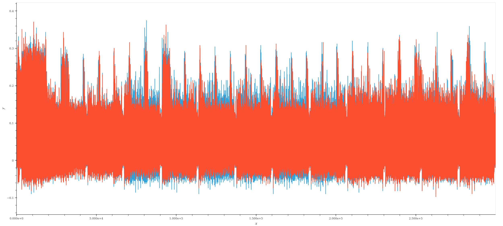

Plotting the difference between the two traces to further highlight this:
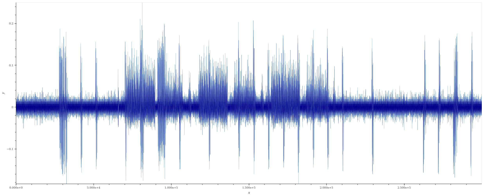

The results of experiments with different values for the second k (e.g.
`0xefff..., 0x0fff...`) agree with our hypothesis.  These results also serve
to suggest where processing starts for the first bit of k.

These results were obtained on p384 with a 22 MHz streamed capture; very
similar results are obtained with p256, as well as at 100 MHz for both p384
and p256.

### Difference of Means Attack
If we can reliably identify when individual bits of k are processed, we can
use this information to build various attacks. One possible attack is a
"difference of means" (DoM) attack: using a known k, we compute the average
power trace when processing a bit of k which is 1, and the average power
trace when processing a bit of k which is 0. Comparing these averages may
reveal markers which leak the value of the bit that's being processed.

In the following we first attempt the attack on p384 traces collected at 22
MHz; the 100 MHz case is discussed afterwards.

#### Accurately Finding Bits
In order to compute these averages, we need accurate bit times. We use the
idle times as a marker for this. With p256, these idle times are extremely
clear and well-defined:
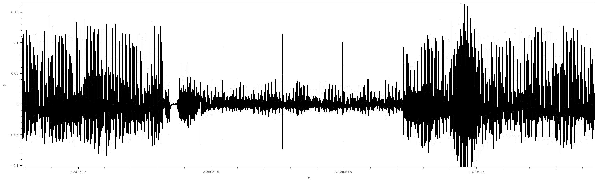

whereas with p384, they are less clear:

In the following we describe the p384 case as it is the most challenging of
the two. We first apply a moving average over 1500 samples to more easily
pick out the idle period:
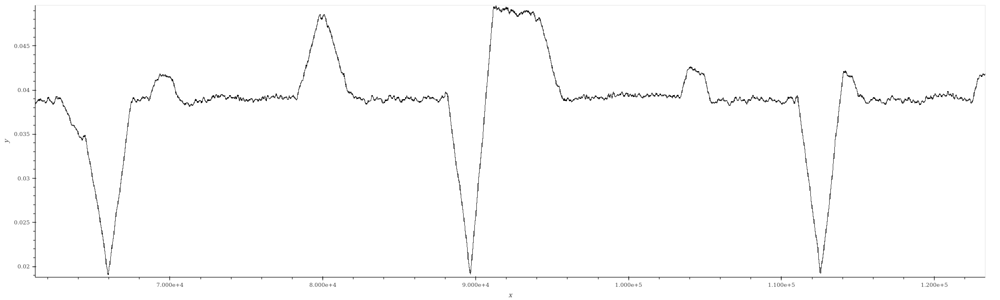

This provides a first guess at bit processing times. If we super-impose the
trace for a few bits using these times, we are likely to find poor
alignment. Since the full power trace shows consistent peaks every 10
cycles throughout, we would expect these to align perfectly if we had
accurate bit times. Our extracted bit times show bit processing times that
are almost constant; if we adjust them to be constant (using the average
time delta between successive bit times), we find perfect alignment:
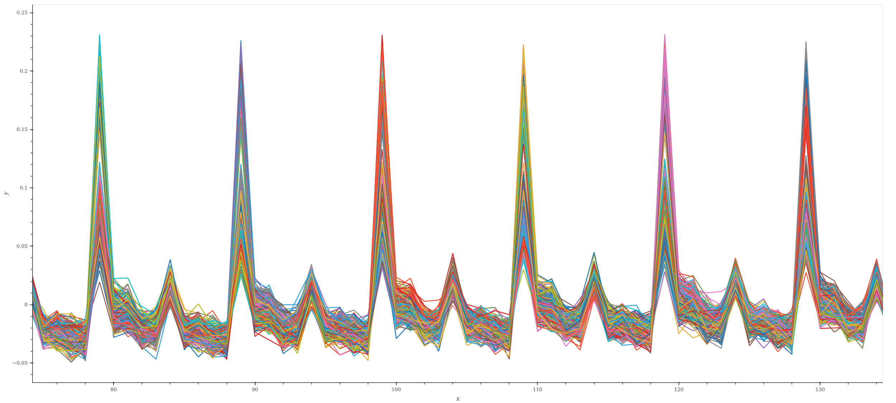

#### The Attack
We can now compute the difference between average ones and averages zeros as
defined above:
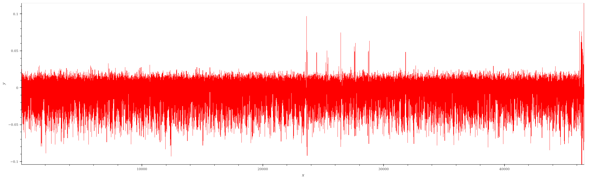

Using the time indices where the difference of means exceeds a fixed
threshold as markers, we can test whether these markers are useful
towards extracting k from a single power trace. With k set to {128 ones, 256
zeros} we find clear leakage. While we could not accurately guess each bit
of k from this, we could accurately guess several bits:
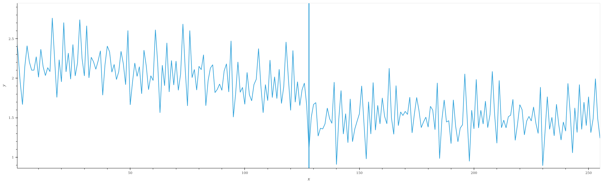
(The vertical line indicates bit 128. We do not show all 384 bits because we
are unable to capture the complete operation, as discussed previously.)

Using these same markers, we can also see useful leakage from a single power
trace for k composed of alternating 32 ones and 32 zeros:
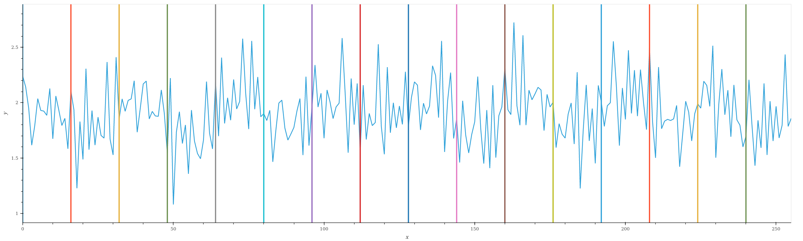

### Discussion
The leakage found does not provide full recovery of k, but it does show that
leakage exists, and suggests a starting point for building a complete
attack. It is possible that the scalar blinding discussed in p384\_sign.s
serves to mask the 1 vs 0 leakage. If scalar blinding is implemented as is
commonly understood, then the raw scalar k is still being used directly, and
since the double-add loop is said to operate on both scalar shares in
parallel, this would explain the leakage found here.

### 100 MHz capture
With a 100 MHz capture, the raw power trace appears similar but the attack
becomes more complicated.
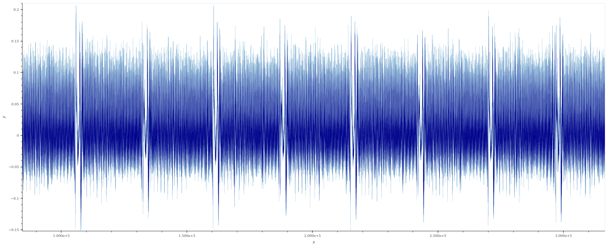

Operation time is no longer constant, even when k is held constant. Five
captures of the same portion of the same p384 operation with the same k show
unaligned traces:
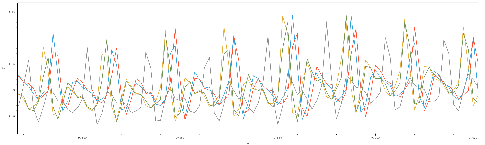

We also observe that the regular peaks, which in the 22 MHz capture were
always every 10 cycles, are no longer equally-spaced.

This has two implication:
1. Bit processing times are no longer constant, making it harder to
   accurately identify bit start times.
2. Since the full power trace must be assembled from multiple captures, we
   cannot get a fully accurate capture: some power samples will get measured
   twice, others not at all. (This is a setup issue which will be resolved
   when the target can operate at a sufficiently slow speed below 22 MHz.)

Nevertheless, we proceed with the attack to see how well it can perform. We
follow the same approach, except that we use raw estimated bit start times
(instead of adjusting them to be equally-spaced, since we know they are
not).

We obtain the following difference of means plot:
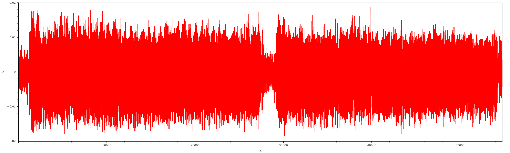

Then, using the largest differences as a marker to distinguish zeros from
ones, with k again set to {128 ones, 256 zeros}, we get the following
scores:
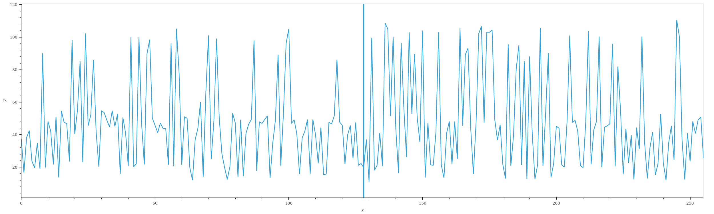

The difference between the first and second halves is not as striking, and
few if any bits could be correctly identified, but there is a difference.
It's possible that if (1) bit start times were extracted with better
accuracy, and (2) if the power trace could be properly collected, better
results would be obtained.

# Recommendations and Next Steps
This exercise has highlighted the presence of leakage which could be
exploited to build an attack to recover k. It appears that countermeasures
are more effective at 100 MHz, but it's also possible that addressing the
trace collection issue would by itself make a significant difference.

The leakage on the leading one bit of k is also present at 100 MHz. There
are many known attacks which leverage this leakage to recover all the bits
of k from this kind of leakage (e.g. using the hidden number problem).

One way to better resist these attacks is to make the bits harder to find.
Even in the 100 MHz case, it's currently very easy to visually see the rough
location of the bits. From this, it may be that all that stands in the way
of a more successful attack is enough time and determination to guess more
accurate bit times.

Once improvements are made, it may be worthwhile to integrate bit time
identification into the standard CI flow. For example, if the FPGA target
can be set up in a way which allows the exact same operation (including
randomizations) to be run in simulation, then a battery of attempts to
extract bit times could be run against power traces, and those guessed times
compared against the actual times (obtained from simulation) thus ensuring
that the bits are sufficiently well hidden.

# Notebooks
The following notebooks can be used to replicate all the results presented
here:

- `otbn_traces.ipynb`: trace acquisition.
- `otbn_find_bits_p384.ipynb`: finding bit start times and running DoM
  attack for p384 traces acquired at 22 MHz.
- `otbn_find_bits_p384_100M.ipynb`: finding bit start times and running DoM
  attack for p384 traces acquired at 100 MHz.

Some tweaking may be required in the attack scripts from run to run, in
particular in the 100 MHz case. The results shown here were not
cherry-picked: better looking results have been observed. It's also possible
to obtain worse-looking results.

